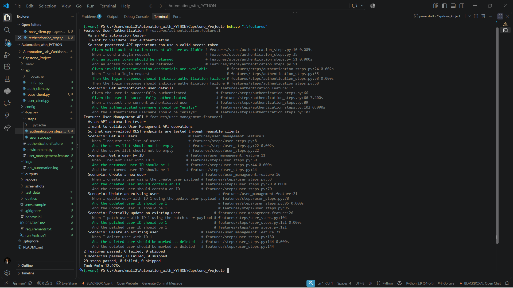
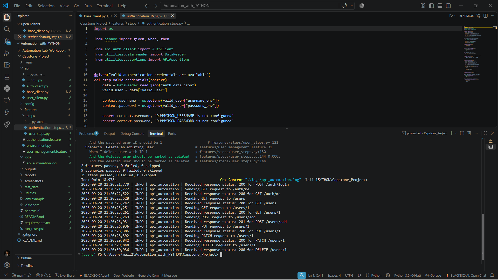
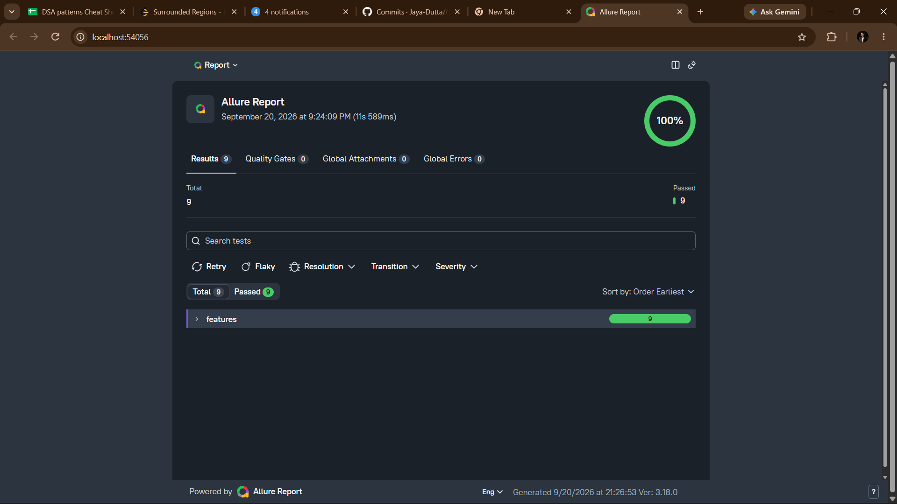

# Python API Automation Framework with Requests + Behave BDD

A professional and reusable API automation framework built with **Python, Requests, Behave BDD, and Allure Reporting** for testing a User Management REST API.

## 📌 Project Overview

This project demonstrates how a maintainable API automation framework can be designed using Python.

The framework automates authentication and User Management API operations through **BDD-style Gherkin scenarios**. API communication is separated from test steps using reusable client classes, while response validation, configuration management, test data, logging, and reporting are handled through dedicated framework components.

### Framework Flow

```text
Gherkin Feature
       ↓
Behave Step Definition
       ↓
API Client Layer
       ↓
Base API Client
       ↓
Requests Library
       ↓
DummyJSON REST API
       ↓
Response Validation
       ↓
Logging
       ↓
Allure Reporting
```

---

## 🎯 Objectives

The main objectives of this project are to:

* Automate REST API testing using Python.
* Use the Requests library for HTTP communication.
* Implement BDD testing with Behave.
* Automate authentication and protected API access.
* Validate GET, POST, PUT, PATCH, and DELETE operations.
* Separate reusable API clients from test scenarios.
* Externalize test data into JSON files.
* Manage configuration separately from implementation.
* Implement reusable response assertions.
* Add framework-level logging.
* Handle API communication errors using custom exceptions.
* Generate Allure test reports.
* Maintain a clean and reusable project structure suitable for GitHub and academic demonstration.

---

## 🧰 Technologies Used

| Technology | Purpose                              |
| ---------- | ------------------------------------ |
| Python     | Programming language                 |
| Requests   | REST API communication               |
| Behave     | BDD test execution                   |
| Gherkin    | Human-readable test scenarios        |
| Allure     | Test reporting                       |
| PyYAML     | YAML configuration handling          |
| JSON       | External test data                   |
| Logging    | API execution logging                |
| PowerShell | Environment setup and test execution |

---

## 🌐 API Under Test

This project uses **DummyJSON** as the REST API under test.

**Base URL:**

```text
https://dummyjson.com
```

DummyJSON provides authentication and User Management endpoints suitable for demonstrating API automation concepts.

### Why DummyJSON?

The API was selected because it provides:

* Authentication endpoints.
* Bearer token authentication.
* User retrieval.
* User creation.
* User update.
* Partial update.
* User deletion.
* Predictable JSON responses.
* A public testing environment suitable for automation practice.

### Important API Limitation

DummyJSON simulates write operations such as create, update, patch, and delete.

These operations return realistic API responses, but the changes are **not permanently persisted to the server dataset**.

Therefore, this project validates the API response behavior rather than claiming permanent database modification.

---

# 🔐 Authentication Testing

The framework validates both successful and unsuccessful authentication.

### Successful Login

```text
POST /auth/login
Expected Status: 200
```

The framework receives an access token and stores it **in memory only**.

The token is then used to create:

```text
Authorization: Bearer <access_token>
```

### Invalid Login

```text
POST /auth/login
Expected Status: 400 or 401
```

The framework verifies that invalid credentials result in an authentication failure.

### Authenticated User

```text
GET /auth/me
Expected Status: 200
```

The framework validates the authenticated user's information.

---

# 👤 User Management API

The framework automates the following User Management operations:

| Operation      | HTTP Method | Endpoint     | Expected Status |
| -------------- | ----------- | ------------ | --------------: |
| Get all users  | GET         | `/users`     |             200 |
| Get user by ID | GET         | `/users/1`   |             200 |
| Create user    | POST        | `/users/add` |             201 |
| Update user    | PUT         | `/users/1`   |             200 |
| Partial update | PATCH       | `/users/1`   |             200 |
| Delete user    | DELETE      | `/users/1`   |             200 |

---

# 🧪 BDD Test Scenarios

The project currently contains **9 automated scenarios**.

### Authentication Feature

1. Successful user login
2. Invalid user login
3. Get authenticated user details

### User Management Feature

4. Get all users
5. Get a user by ID
6. Create a new user
7. Update an existing user
8. Partially update an existing user
9. Delete an existing user

All scenarios are written using Gherkin syntax so that the expected API behavior is easy to understand.

---

# 🏗️ Framework Architecture

The framework follows a layered design.

### 1. Feature Layer

Contains business-readable BDD scenarios.

```text
features/
├── authentication.feature
└── user_management.feature
```

### 2. Step Definition Layer

Maps Gherkin steps to Python implementation.

```text
features/steps/
├── authentication_steps.py
└── user_steps.py
```

### 3. API Client Layer

Provides reusable API operations.

```text
api/
├── base_client.py
├── auth_client.py
└── user_client.py
```

### 4. Configuration Layer

Stores environment and API configuration separately.

```text
config/
├── config.yaml
└── config_reader.py
```

### 5. Test Data Layer

Stores authentication references and request payloads outside the test implementation.

```text
test_data/
├── auth_data.json
└── user_payloads.json
```

### 6. Utility Layer

Contains reusable framework utilities.

```text
utilities/
├── assertions.py
├── data_reader.py
├── exceptions.py
└── logger.py
```

---

# 📁 Project Structure

```text
Capstone_Project/
│
├── api/
│   ├── __init__.py
│   ├── auth_client.py
│   ├── base_client.py
│   └── user_client.py
│
├── config/
│   ├── config.yaml
│   └── config_reader.py
│
├── features/
│   ├── authentication.feature
│   ├── environment.py
│   ├── user_management.feature
│   └── steps/
│       ├── authentication_steps.py
│       └── user_steps.py
│
├── test_data/
│   ├── auth_data.json
│   └── user_payloads.json
│
├── utilities/
│   ├── __init__.py
│   ├── assertions.py
│   ├── data_reader.py
│   ├── exceptions.py
│   └── logger.py
│
├── reports/
│   ├── allure-results/
│   └── allure-report/
│
├── logs/
│   └── api_automation.log
│
├── screenshots/
│   ├── 01_behave_full_execution_passed.png
│   ├── 02_api_execution_logs.png
│   └── 03_allure_report_dashboard.png
│
├── .env.example
├── .gitignore
├── behave.ini
├── README.md
├── requirements.txt
└── run_tests.ps1
```

> Generated reports, runtime logs, local credentials, Python virtual environments, and cache files are excluded from Git through `.gitignore`.

---

# ⚙️ Configuration Management

API configuration is maintained in:

```text
config/config.yaml
```

Current configuration includes:

```yaml
environment: "qa"

api:
  base_url: "https://dummyjson.com"
  timeout: 10

authentication:
  login_endpoint: "/auth/login"
  me_endpoint: "/auth/me"
```

This prevents API configuration values from being hardcoded throughout the framework.

---

# 🔑 Credential Management

Authentication credentials are **not stored directly in the source code**.

The framework reads credential references from:

```text
test_data/auth_data.json
```

The actual values are supplied through environment variables:

```text
DUMMYJSON_USERNAME
DUMMYJSON_PASSWORD
```

A safe example file is provided:

```text
.env.example
```

Real credentials and `.env` files are excluded from Git.

Access tokens are stored only in memory during execution and are not printed or written to project logs.

---

# 📦 External Test Data

Request payloads are maintained separately in:

```text
test_data/user_payloads.json
```

Example operations include:

```text
create_user
update_user
patch_user
```

This approach makes the test scenarios easier to maintain and allows test data to be changed without modifying API client implementation.

---

# ✅ Reusable Assertions

The framework contains reusable API assertions in:

```text
utilities/assertions.py
```

Implemented validations include:

* HTTP status code validation.
* JSON field existence.
* JSON field equality.
* Boolean field validation.
* Non-empty list validation.

This prevents duplicate assertion logic across step definitions.

---

# 📝 Logging

Framework-level logging is implemented using Python's `logging` module.

Log file:

```text
logs/api_automation.log
```

The framework records:

* HTTP method.
* Endpoint.
* Response status code.
* API execution events.
* API communication errors.

Example:

```text
Sending GET request to /users
Received response status: 200 for GET /users

Sending POST request to /users/add
Received response status: 201 for POST /users/add
```

Sensitive credentials and access tokens are not logged.

---

# ⚠️ Error Handling

The framework defines a custom exception:

```text
utilities/exceptions.py
```

```text
APIFrameworkError
```

The Base API Client handles common Requests exceptions such as:

* Timeout.
* Connection errors.
* Other Requests-level failures.

These errors are converted into framework-specific exceptions and logged appropriately.

---

# 📊 Allure Reporting

Allure is integrated with Behave to generate test execution reports.

Generate Allure results:

```powershell
behave ".\features" -f allure_behave.formatter:AllureFormatter -o ".\reports\allure-results"
```

Generate the HTML report:

```powershell
allure generate ".\reports\allure-results" --output ".\reports\allure-report"
```

Open the report:

```powershell
allure open ".\reports\allure-report"
```

---

# 📈 Test Execution Results

The final fresh execution produced:

```text
2 features passed, 0 failed, 0 skipped
9 scenarios passed, 0 failed, 0 skipped
29 steps passed, 0 failed, 0 skipped
```

### Final Result

**9 / 9 scenarios passed — 100%**

The final execution also verified the complete API flow:

```text
POST /auth/login → 200
POST /auth/login → 400
POST /auth/login → 200
GET  /auth/me    → 200
GET  /users      → 200
GET  /users/1    → 200
POST /users/add  → 201
PUT  /users/1    → 200
PATCH /users/1   → 200
DELETE /users/1  → 200
```

---

# 📸 Execution Evidence

## 1. Behave BDD Execution

The complete BDD execution demonstrates that all 9 scenarios passed successfully.



---

## 2. API Execution Logs

The logging output demonstrates the HTTP methods, endpoints, and response status codes generated during framework execution.



---

## 3. Allure Report Dashboard

The Allure dashboard provides a visual summary of the automated test execution.



---

# 🚀 Installation and Setup

## 1. Clone the Repository

```powershell
git clone <repository-url>
```

Navigate into the project:

```powershell
cd Capstone_Project
```

---

## 2. Create Virtual Environment

```powershell
python -m venv .venv
```

Activate it:

```powershell
.\.venv\Scripts\Activate.ps1
```

---

## 3. Install Dependencies

```powershell
pip install -r requirements.txt
```

---

## 4. Configure Credentials

Set the required environment variables in the local terminal.

Example:

```powershell
$env:DUMMYJSON_USERNAME="your_username"
$env:DUMMYJSON_PASSWORD="your_password"
```

Do not commit actual credentials.

---

# ▶️ Running the Tests

Run all Behave scenarios:

```powershell
behave ".\features"
```

Expected final summary:

```text
2 features passed, 0 failed, 0 skipped
9 scenarios passed, 0 failed, 0 skipped
29 steps passed, 0 failed, 0 skipped
```

---

# 📊 Generating the Allure Report

Run:

```powershell
behave ".\features" -f allure_behave.formatter:AllureFormatter -o ".\reports\allure-results"
```

Then:

```powershell
allure generate ".\reports\allure-results" --output ".\reports\allure-report"
```

Finally:

```powershell
allure open ".\reports\allure-report"
```

---

# 🧠 Key Framework Design Concepts Demonstrated

This project demonstrates practical API automation concepts including:

* REST API testing.
* HTTP methods.
* Status code validation.
* Authentication.
* Bearer token handling.
* BDD with Gherkin.
* Reusable API clients.
* Separation of test and implementation layers.
* Configuration management.
* External test data.
* Reusable assertions.
* Logging.
* Exception handling.
* Allure reporting.
* Git/GitHub project organization.
* Secure handling of local credentials.

---

# 💼 Real-World Relevance

The framework structure represents common patterns used in API automation projects:

```text
Test Scenarios
      ↓
Reusable Test Steps
      ↓
API Client Abstraction
      ↓
HTTP Request Layer
      ↓
Response Validation
      ↓
Logging & Reporting
```

In a real enterprise automation framework, the same architecture can be extended with:

* Multiple environments.
* CI/CD integration.
* API schema validation.
* Authentication token refresh.
* Parameterized test suites.
* Database validation.
* Advanced reporting.
* Parallel execution.
* Test tagging and selective execution.

---

# 🔮 Future Improvements

Possible future enhancements include:

* CI/CD integration using GitHub Actions.
* JSON Schema response validation.
* Environment-specific configuration files.
* Additional API resources.
* Parameterized BDD scenarios.
* API contract testing.
* Retry mechanisms for selected transient failures.
* Parallel API test execution.

These are intentionally kept outside the current implementation to maintain a clear and beginner-friendly framework.

---

# 👨‍💻 Project Summary

This project demonstrates a complete API automation workflow using:

```text
Python
   +
Requests
   +
Behave BDD
   +
DummyJSON REST API
   +
Reusable API Clients
   +
Reusable Assertions
   +
Logging
   +
Custom Exception Handling
   +
Allure Reporting
```

**Final automated test result: 9/9 scenarios passed.**
